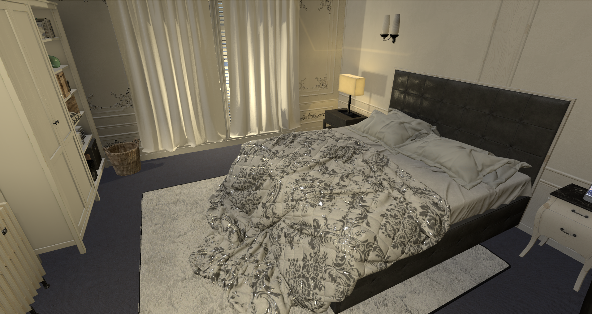
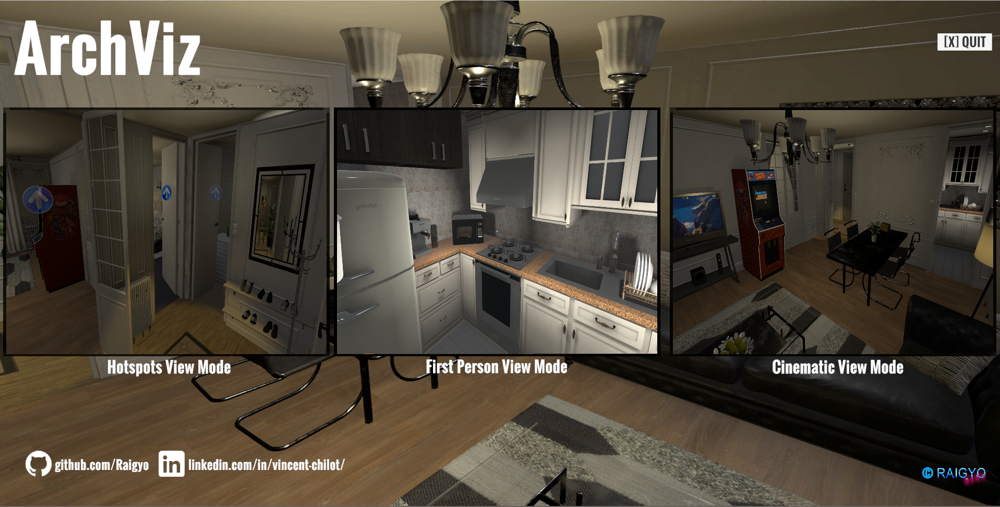
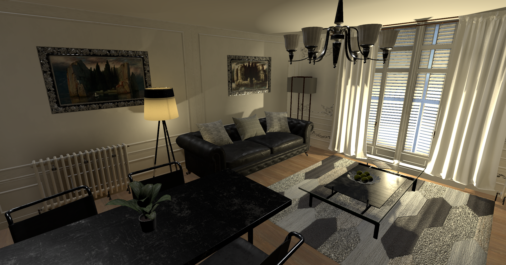

# Unity 3D / C# / Visual Studio - Original house visit development - 'Archviz'

*December 2019 - Development time: 10 days*

> 🔨 House visit made with Unity 3D (ver. 2019.2.4f1). Visit a non existing house in a realistic 3D environment. There are 3 modes: First person mode, Spots points mode or Cinematic mode. you can select which mode you want to use in the main menu.

* * *

## 1. Installation

### 1.1 Windows x86_64

#### 1.1.1 Windows Installer

Download the installer [here](https://drive.google.com/open?id=13kh3w4LQrgfKp57up_Io9YWK4L7V4ujx) [751.5Mb] and just follow the instructions.

#### 1.1.2 Zip version

Download the zip with the game [here](https://drive.google.com/open?id=1kudvA38s1xdAdMsSKiN44rMFpHY8lRLP) [887Mb] and unzip archviz-windows64.zip on your computer.

In 'archviz-windows64' launch architecture.exe by clicking on it to play.

### 1.2 Mac OSX

Download the zip with the game [here](https://drive.google.com/open?id=1Ht8BsUuc6hs_5jTsKUAzSrXocmY-JQI5) [919Mb] and unzip archviz-mac-osx.zip on your computer.

In 'archviz-mac-osx' launch archviz-mac-osx.app by clicking on it to play.

Warning: It's not an approved Mac App Store application so you will have to select 'allow apps downloaded from anywhere' or click on 'open anyway' on the alert box if you want to launch the game.

### 1.3 Scripts for reviewing

Scripts used are in the [scripts folder](https://github.com/Raigyo/unity-3d-archviz/tree/master/scripts) on this repository.

*-------*

## 2. About

This application is a showcase in which you can visit a house. The house has been 'build' by me using Unity 3D, some assets from the asset store, Probuilder3D et Progrid components and even a ruler.

### 2.1. How to play

#### 2.1.1. Spots points view mode

Navigate in the different rooms by clicking with left button on the differents arrows around you (like in *Google Street Maps*).

You can rotate the view using your mouse and zoom in / out using the scroll button of your mouse.

#### 2.1.2. First person view mode

Same view than in 'FPS' games. Use arrows to move and the mouse to look around.

#### 2.1.3. Cinematic view mode

Nothing to do here, just watch the cinematic!

*-------*

## 3. Techniques / Assets / Scripts

### 3.1. Intro scene (scene name: intro)

#### 3.1.1. Menu

You can select between the different views modes.

The view selected is managed by Scriptable Objects (that can be sused as 'global' variables between scenes).

The three versions of the showcase are just one scene with some GameObjects displayed (especially cameras) or not according to the value in the Scriptable Objects. This value is reset each time we comme back to the intro scene.

### 3.2. Application scene (scene name: archviz)

#### 3.2.1. The house

Made with several assets from the Unity asset store including *ArchVizPRO Interior Vol.3* and *ArchVizPRO Interior Vol.3*.

#### 3.2.2. Lights

The most difficult part to manage according to me. In that kind of application they are very important for the atmosphere.

There are several realtime lights:

- Two directionnal lights (key and backlights), without shadows. They are enhanced with [Aura 2 - Volumetric Lighting & Fog - Raphael Ernaelsten](https://assetstore.unity.com/packages/tools/particles-effects/aura-2-volumetric-lighting-fog-137148).
- Four points lights are used in realtime in the room and living that provide shadows and relief.

Baked lights:

- Many lightmaps / baked (= prerendered) lights are used in the differents rooms including spot lights and point lights.
- There are reflexion probes in each rooms.

On each camera (on camera per mode), there is post processing: the one provided by Unity and [MadGoat SSAA & Resolution Scale - MadGoat Studio](https://assetstore.unity.com/packages/vfx/shaders/fullscreen-camera-effects/madgoat-ssaa-resolution-scale-86368))

#### 3.2.3. Script: [HitBehaviour.cs](scripts/HitBehaviour.cs)

Script that uses raycast especially in Spot Points Mode to manage the click on arrows.

It could be used for some other actions in each mode because the camera used is send by LevelManager.cs.

#### 3.2.4. Script: [MenuManager.cs](scripts/MenuManager.cs)

Used only in menu to select the game mode.

#### 3.2.5. Script: [LevelManager.cs](scripts/LevelManager.cs)

Manages what's displayed on the screen according the mode played.

#### 3.2.6. Script: [SpotCamMouseMovements.cs](scripts/SpotCamMouseMovements.cs)

Manages the control of the mouse in Spot Play Mode. Many settings can be edited in the editor.

#### 3.2.7. Script: [SpotCamChangeRoom.cs](scripts/SpotCamChangeRoom.cs)

Detects in which room we want to go in Spot Play Mode.

#### 3.2.8. Script: [Mirror.cs](scripts/Mirror.cs)

Manages the realistic reflexion in mirrors.

#### 3.2.9. Script: [Rotator.cs](scripts/Rotator.cs)

Manages the rotation of the food in the micro-wave.

#### 3.2.10. Script: [Clock.cs](scripts/Clock.cs)

Script from **Andre "AEG" Bürger** modified to display the day and date on the smartphone in room.

It has also been modified to display on the clock and on the smartphone the real hour / day.

#### 3.2.10. Cinematics

Cinematic mode has been made with the asset [Pegasus - Procedural Worlds](https://assetstore.unity.com/packages/tools/animation/pegasus-65397). Useful to make cinematics / cut scenes quite quickly (better than animator or cinemachine).

*-------*

## 4. Credits

### 4.1. Video, Music & Sounds

- [Melissa - Eveningland | Royalty Free Music - No Copyright Music](https://www.youtube.com/watch?v=RPb4Y0V-kUw)
- [Spring - Blender Open Movie](https://www.youtube.com/watch?v=WhWc3b3KhnY)
- [Your Love - bloome | Background Music For Videos No Copyright Chill Vlog Music Royalty Free Calm EDM](https://www.youtube.com/watch?v=8ZjExjlcla8)

### 4.2. Assets used

#### 4.2.1. Unity Asset Store

- [3D Game Kit - Unity Technologies](https://assetstore.unity.com/packages/templates/tutorials/3d-game-kit-115747)
- [ArchVizPRO Interior Vol.3 - ArchVizPRO](https://assetstore.unity.com/packages/3d/environments/archvizpro-interior-vol-3-62337)
- [ArchVizPRO Interior Vol.6 - ArchVizPRO](https://assetstore.unity.com/packages/3d/environments/urban/archvizpro-interior-vol-6-120489)
- [Aura 2 - Volumetric Lighting & Fog - Raphael Ernaelsten](https://assetstore.unity.com/packages/tools/particles-effects/aura-2-volumetric-lighting-fog-137148)
- [Candle Flames - Rivermill Studios](https://assetstore.unity.com/packages/vfx/particles/fire-explosions/candle-flames-48044)
- [Classic Picture Frame - Vertex Studio](https://assetstore.unity.com/packages/3d/props/furniture/classic-picture-frame-59038)
- [Clock - VIS Games](https://assetstore.unity.com/packages/3d/props/interior/clock-4250)
- [Footwear Collection - 3D Everything](https://assetstore.unity.com/packages/3d/props/clothing/footwear-collection-52313)
- [Free Smartphone - Vertex Studio](https://assetstore.unity.com/packages/3d/props/electronics/free-smartphone-90324)
- [House Furniture Pack - Finward Studios](https://assetstore.unity.com/packages/3d/props/house-furniture-pack-88646)
- [Kitchen Appliances with Packaging - Robot Skeleton](https://assetstore.unity.com/packages/3d/props/electronics/kitchen-appliances-with-packaging-155472)
- [Kitchen Props Free - Jake Sullivan](https://assetstore.unity.com/packages/3d/props/interior/kitchen-props-free-80208)
- [MadGoat SSAA & Resolution Scale - MadGoat Studio](https://assetstore.unity.com/packages/vfx/shaders/fullscreen-camera-effects/madgoat-ssaa-resolution-scale-86368)
- [Pegasus - Procedural Worlds](https://assetstore.unity.com/packages/tools/animation/pegasus-65397)
- [Realistic Furniture And Interior Props Pack - Sevastian Marevoy](https://assetstore.unity.com/packages/3d/props/furniture/realistic-furniture-and-interior-props-pack-120379)
- [Shoes Mens / Ladies - Kobra Game Studios](https://assetstore.unity.com/packages/3d/props/clothing/shoes-mens-ladies-73134)
- [Substance in Unity - Allegorithmic](https://assetstore.unity.com/packages/tools/utilities/substance-in-unity-110555)
- [Suburb Neighborhood House Pack Modular - Finward Studios](https://assetstore.unity.com/packages/3d/environments/urban/suburb-neighborhood-house-pack-modular-72712)
- [Ultra Washing Machine PBR - 00Laboratories](https://assetstore.unity.com/packages/3d/props/electronics/ultra-washing-machine-pbr-144339)
- [Umbrella PRO - Indie_G](https://assetstore.unity.com/packages/3d/props/clothing/umbrella-pro-55277)
- [zz Ruler - orange030](https://assetstore.unity.com/packages/tools/utilities/zz-ruler-365)

#### 4.2.2. Free 3D

- [Donkey Kong Jr. - Upright Arcade Machine - daystar65](https://free3d.com/3d-model/donkey-kong-jr-upright-arcade-machine-89019.html)

#### 4.2.3. Turbosquid

- [3D Dauphine Floor Lamp model - Designconnected ](https://www.turbosquid.com/FullPreview/Index.cfm/ID/1388560)
- [Coat tree black painted metall - yuriki](https://www.turbosquid.com/FullPreview/Index.cfm/ID/967969)
- [Green apples - modelplusmodel ](https://www.turbosquid.com/FullPreview/Index.cfm/ID/546276)
- [Thai Sandstone Female model - Hane3D](https://www.turbosquid.com/FullPreview/Index.cfm/ID/1275160)

#### 4.2.4. Cults3d

- [Business card holder - Kevin Gallagher](https://cults3d.com/en/3d-model/various/business-card-holder-donegal3d)

#### 4.2.5. 3DDD

- [Forged umbrella stand - koffer](https://3ddd.ru/3dmodels/show/kovannaia_podstavka_pod_zont)

### 4.3. Softwares

- [Audacity](https://www.audacityteam.org/)
- [Inno Setup - Installer](http://www.jrsoftware.org/isinfo.php)

*-------*

## 5. Useful links & Greetings

- [Brackeys Game Dev Tutorials](https://www.youtube.com/channel/UCYbK_tjZ2OrIZFBvU6CCMiA)
- [DitzelGames](https://www.youtube.com/channel/UCdedu-nAwMACE5WbVcmp3Bg)
- [Epitome](https://www.youtube.com/channel/UCsaXQNLxeHvwJdDUrICGufA)
- [IMERSITY](https://www.youtube.com/channel/UCCCf8Z1iY3yXQUxcnarA0Ag)
- [Info Gamer](https://www.youtube.com/channel/UCyoayn_uVt2I55ZCUuBVRcQ)
- [inScope Studios](https://www.youtube.com/channel/UCyVsCcTte38YC9CxJtw3hBQ)
- [Jason Weimann - Unity 3D College](https://www.youtube.com/channel/UCX_b3NNQN5bzExm-22-NVVg)
- [Learn Everything Fast](https://www.youtube.com/channel/UCG5XadFg6icC2TcF0I5DIig)
- [Raywenderlich](https://www.raywenderlich.com/)
- [SpeedTutor](https://www.youtube.com/channel/UCwYuQIa9lgjvDiZryUVtFGw)
- [Sykoo](https://www.youtube.com/channel/UCNJvwJ6daLmw4_gUKTw4cSg)
- [Sylvain - Créateur 3D](https://www.youtube.com/channel/UC8BM2xQlXcK4Vt3OqfOmj9g)
- [TUTO UNITY FR](https://www.youtube.com/channel/UCJRwb5W4ZzG43J5_dViL6Fw)
- [Unity Guruz](https://www.youtube.com/channel/UCgd3l8iA5zBYVa4sQ6-ONFw)
- [Unity Learn](https://learn.unity.com/)
- [Unity Pour les nuls](https://www.youtube.com/channel/UCuU8cONIgZ182KheI1s6HqQ)
- [Unity3D With Scott](https://www.youtube.com/channel/UC9hfBvn17qSIrdFwAk56oZg)

*-------*

## 6. Contact (Github / Linked In)

- [My Github](https://github.com/Raigyo)
- [My LinkedIn](https://www.linkedin.com/in/vincent-chilot/)

